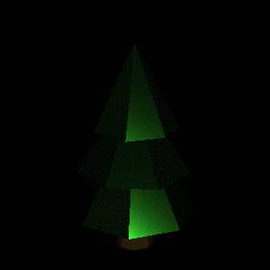
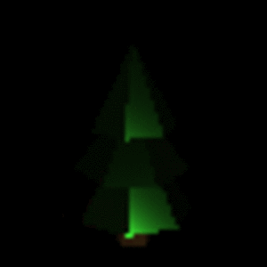

# RayTracer.jl


[](https://codecov.io/gh/avik-pal/RayTracer.jl)
[](https://avik-pal.github.io/RayTracer.jl/dev/)
[](https://submissions.juliacon.org/papers/ebd92f2a47780826004bd88a6fd1f717)
[](https://doi.org/10.5281/zenodo.1442781)

<p align="center">
    <video width="512" height="320" autoplay loop>
        <source src="docs/src/assets/udem1.webm" type="video/webm">
    </video>
</p>

> This package was written in the early days of Flux / Zygote. Both these packages have significantly improved over time. Unfortunately the current state of this package of has not been updated to reflect those improvements. However, I do plan to do a major overhaul of the package around Jan 2021 to integrate these improvements along with the direct use of Flux3D.jl to use more efficient kernels for mesh operations.

A Ray Tracer written completely in Julia. This allows us to leverage the AD capablities provided
by Zygote to differentiate through the Ray Tracer.

## INSTALLATION

This package is registered. So open up a Julia 1.3+ repl and enter the pkg mode.

```julia
julia> ]
(v1.3) pkg> add RayTracer
```

To use the master branch (not recommended) do.

```julia
julia> ]
(v1.3) pkg> add RayTracer#master
```

## TUTORIALS

<div align="center">
  <table>
    <tr>
      <th style="text-align:center">
        <a href="examples/teapot_rendering.jl">Introductory Rendering Tutorial</a>
      </th>
      <th style="text-align:center">
        <a href="examples/inverse_lighting.jl">Inverse Lighting Tutorial</a>
      </th>
      <th style="text-align:center">
        <a href="examples/optim_compatibility.jl">Inverse Rendering with Optim.jl Tutorial</a>
      </th>
    </tr>
    <tr>
      <td align="center">
        <a href="examples/teapot_rendering.jl">
          
        </a>
      </td>
      <td align="center">
        <a href="examples/inverse_lighting.jl">
          
        </a>
      </td>
      <td align="center">
        <a href="examples/optim_compatibility.jl">
          
        </a>
      </td>
    </tr>
  </table>
</div>

## USAGE EXAMPLES

Follow the instructions below to run individual examples or use
`examples/script.sh` to run all of them together.

First we need to get the versions of the packages used when these
examples were written.

```bash
$ cd examples
$ julia --color=yes -e "using Pkg; Pkg.instantiate()"
```

Now we can run any of the file we need by
`julia --project=. --color=yes "/path/to/file"`

### Running Individual Examples

* [`teapot_rendering.jl`](examples/teapot_rendering.jl) -- We need to download the `teapot.obj` file.

```
wget https://raw.githubusercontent.com/McNopper/OpenGL/master/Binaries/teapot.obj
```

* [`performance_benchmarks.jl`](examples/performance_benchmarks.jl) -- We need the mesh and texture for
  the yield sign board.

```bash
$ mkdir meshes
$ cd meshes
$ wget https://raw.githubusercontent.com/avik-pal/RayTracer.jl/master/test/meshes/sign_yield.obj
$ wget https://raw.githubusercontent.com/avik-pal/RayTracer.jl/master/test/meshes/sign_yield.mtl
$ cd ..

$ mkdir textures
$ cd textures
$ wget https://raw.githubusercontent.com/avik-pal/RayTracer.jl/master/test/textures/wood_osb.jpg
$ wget https://raw.githubusercontent.com/avik-pal/RayTracer.jl/master/test/textures/sign_yield.png
$ cd ..
```

This example requires a few arguments to be passes from command line. Chack them using

`julia  --project=. --color=yes "performance_benchmarks.jl" --help`

* [`inverse_lighting.jl`](examples/inverse_lighting.jl) &
  [`optim_compatibility.jl`](examples/optim_compatibility.jl) -- We need to the `tree.mtl`
  and `tree.obj` files.

```
$ wget https://raw.githubusercontent.com/tejank10/Duckietown.jl/master/src/meshes/tree.obj 
$ wget https://raw.githubusercontent.com/tejank10/Duckietown.jl/master/src/meshes/tree.mtl
```

### Additional Examples

[Duckietown.jl](https://github.com/tejank10/Duckietown.jl) uses RayTracer.jl for generating renders
of a self-driving car environment. For more complex examples of RayTracer, checkout that project.

## SUPPORTING AND CITING:

This software was developed as part of academic research. If you would like to help support it, please star the repository. If you use this software as part of your research, teaching, or other activities, we would be grateful if you could cite the following:

```
@misc{pal2019raytracerjl,
    title={{RayTracer.jl: A Differentiable Renderer that supports Parameter Optimization for Scene Reconstruction}},
    author={Avik Pal},
    year={2019},
    eprint={1907.07198},
    archivePrefix={arXiv},
    primaryClass={cs.GR}
}
```

## CURRENT ROADMAP

These are not listed in any particular order

- [X] Add more types of common objects (use mesh rendering for this)
- [X] Add support for rendering arbitrary mesh
- [X] Inverse Rendering Examples
- [X] Texture Rendering
- [ ] Application in Machine Learning Models through Flux (work in progress)
- [ ] Major Overhaul using Flux3D.jl
- [ ] Exploit the latest improvements to Flux and Zygote
